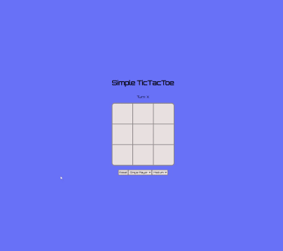

# Simple Tic Tac Toe
A responsive and interactive Tic Tac Toe game built with HTML, CSS, and JavaScript.

# Gameplay

LIVE SITE:  https://lorcanbrophy.github.io/TicTacToe/

# Features
- Start screen to preload audio for smoother gameplay

- Sound effects for moves, menu selection, and wins

- Singleplayer mode with three difficulty levels: Easy, Medium, Hard

- Multiplayer (local, pass-and-play) mode

- Reset functionality to restart the game

- Visual turn indicator and animated background transitions

- Mobile-friendly and responsive layout

# Controls
- Click a cell to make a move

- Use the dropdown to switch between singleplayer and multiplayer

- Select difficulty (singleplayer only)

- Click "Reset" to restart the game

# Folder Structure

#### TicTacToe/
#### &nbsp;&nbsp;&nbsp;├── index.html
#### &nbsp;&nbsp;&nbsp;├── style.css
#### &nbsp;&nbsp;&nbsp;├── script.js

#### &nbsp;&nbsp;&nbsp;├── sounds/
#### &nbsp;&nbsp;&nbsp;&nbsp;&nbsp;&nbsp;&nbsp;├── move.mp3
#### &nbsp;&nbsp;&nbsp;&nbsp;&nbsp;&nbsp;&nbsp;├── select.mp3
#### &nbsp;&nbsp;&nbsp;&nbsp;&nbsp;&nbsp;&nbsp;└── win.mp3

# Setup and Usage
Play from live site: https://lorcanbrophy.github.io/TicTacToe/

OR

Download or clone the repository and open index.html in any modern web browser.

# Technologies Used

- HTML

- CSS

- JavaScript

- Howler.js for audio support
